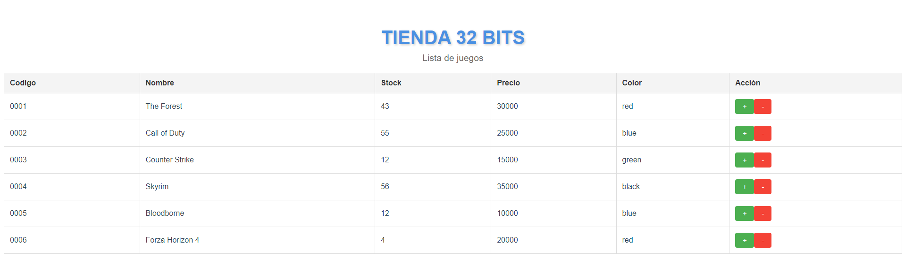

# Proyecto de Gestión de Juegos con Vue.js y Vuex

  <!-- Reemplaza con la URL de tu imagen -->

## Descripción

Este proyecto es una aplicación web construida con **Vue.js** y **Vuex**, utilizando **Vue CLI**. Permite gestionar una lista de juegos, mostrando información relevante y ofreciendo la posibilidad de modificar el stock de cada juego.

---

## Requerimientos

1. **Crear un Proyecto con Vue CLI**:
   - Configuración inicial del proyecto con Vue CLI, incluyendo Babel y Vuex.

2. **Alojar el JSON de Juegos en el Estado Global**:
   - Los datos de los juegos están almacenados en el estado global de la aplicación.

3. **Utilizar `mapState` para Consumir los Juegos**:
   - Implementación de `mapState` para acceder a los datos de los juegos en el componente.

4. **Utilizar Acciones para Modificar el Stock**:
   - Implementación de acciones en Vuex para incrementar y decrementar el stock de los juegos.

---

## Tecnologías Utilizadas

- **Vue.js**: Framework de JavaScript para construir interfaces de usuario.
- **Vuex**: Librería de gestión del estado para Vue.js.
- **Vue CLI**: Herramienta de línea de comandos para crear y gestionar proyectos Vue.js.
- **Babel**: Transpilador de JavaScript para asegurar compatibilidad con navegadores antiguos.

---
## Explicación del Código

### **1. Estado Global con Vuex**

En nuestro proyecto, utilizamos **Vuex** para gestionar el estado global. Aquí es donde se aloja la información sobre los juegos.

- **Estado Global**: La información de los juegos se encuentra en el [estado de Vuex](./src/store/index.js#L5).

### **2. Mutaciones**

Las mutaciones permiten modificar el estado de manera sincrónica. En este proyecto, tenemos mutaciones para incrementar y decrementar el stock de los juegos.

- **Mutación para Incrementar el Stock**: Ver [mutación para incrementar el stock](./src/store/index.js#L51).
- **Mutación para Decrementar el Stock**: Ver [mutación para decrementar el stock](./src/store/index.js#L58).

### **3. Acciones**

Las acciones despachan las mutaciones y pueden realizar operaciones asíncronas. En nuestro caso, despachamos acciones para modificar el stock.

- **Acción para Incrementar el Stock**: Ver [acción para incrementar el stock](./src/store/index.js#L67).
- **Acción para Decrementar el Stock**: Ver [acción para decrementar el stock](./src/store/index.js#L70).

### **4. Consumo del Estado en el Componente**

Utilizamos **`mapState`** y **`mapActions`** para conectar el estado y las acciones de Vuex con el componente.

- **Mapeo del Estado**: Ver [mapeo del estado](./src/components/ListaDeJuegos.vue#L41).
- **Mapeo de Acciones**: Ver [mapeo de acciones](./src/components/ListaDeJuegos.vue#L44).

### **5. Flujo de Trabajo**

1. **Acceso al Estado**: El estado de los juegos se accede en el componente utilizando **`mapState`**.
2. **Despacho de Acciones**: Las acciones que modifican el stock se despachan desde el componente utilizando **`mapActions`**.
3. **Mutaciones**: Las acciones llaman a las mutaciones para realizar cambios sincrónicos en el estado global.

